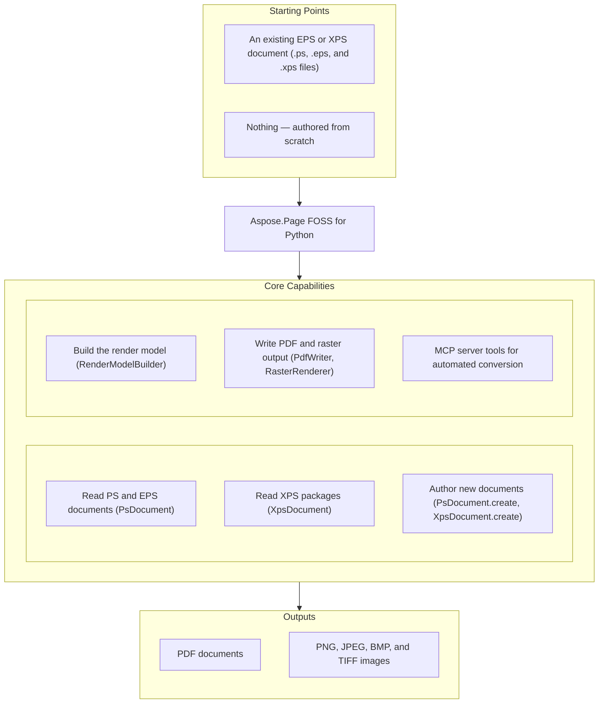
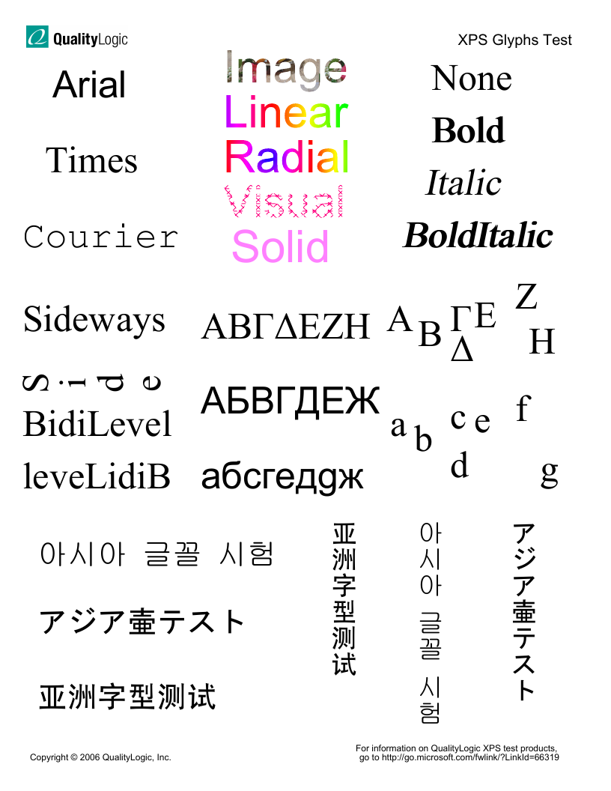
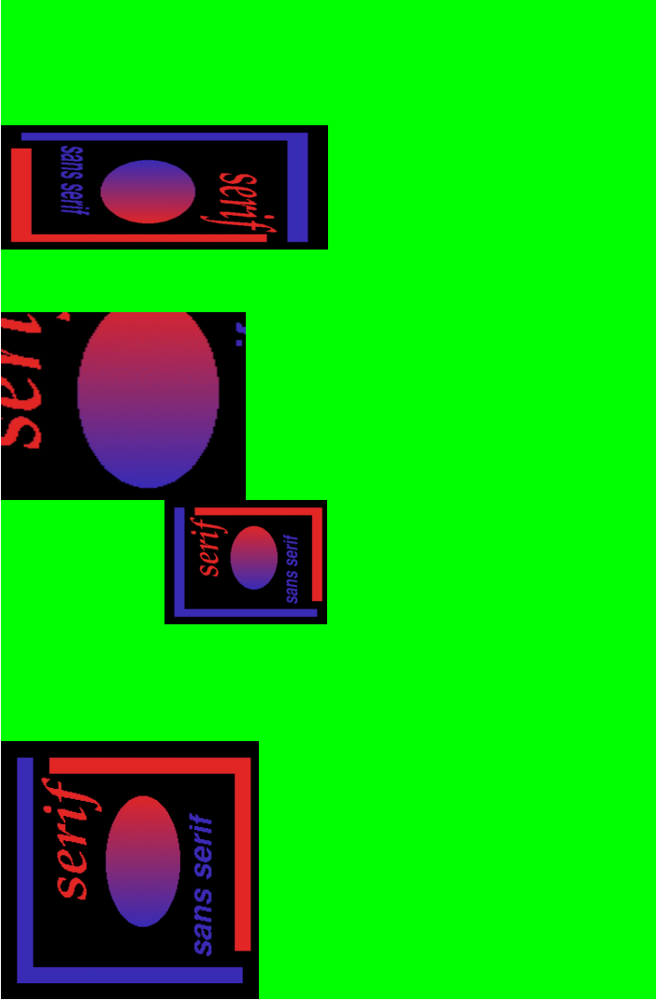

# Aspose.Page FOSS for Python

[](LICENSE.txt) [](pyproject.toml) [](https://github.com/aspose-page-foss/Aspose.Page-FOSS-for-Python/graphs/contributors) [](https://pypi.org/project/aspose-page-foss/)

[](https://products.aspose.org/page/python/)

Aspose.Page FOSS for Python is a free, open-source, MIT-licensed, pure-Python library for
working with PostScript, Encapsulated PostScript (EPS), and XPS documents. It reads and authors
PS/EPS and XPS content directly, builds page content programmatically through its own render
model, and writes PDF or raster (PNG, JPEG, BMP, TIFF) output without Ghostscript or Adobe
tooling. Raster output uses the free `skia-python` package, which has native components. The
same conversions are also exposed as MCP tools for LLM-agent and automation workflows.

## Navigation

- [At a Glance](#at-a-glance)
- [Key Capabilities](#key-capabilities)
- [Installation](#installation)
- [Dependencies](#dependencies)
- [Quick Start](#quick-start)
- [Additional Examples](#additional-examples)
- [API Reference](#api-reference)
- [Documentation & Resources](#documentation--resources)
- [Scope and Limitations](#scope-and-limitations)
- [Development and Testing](#development-and-testing)
- [License](#license)

## At a Glance



## Key Capabilities

- Read and parse PS/EPS documents with `PsDocument.from_file()` / `from_bytes()`, backed by a
  full PostScript interpreter (`PsInterpreter`, `PsParser`, `PsTokenizer`, `OperatorRegistry`)
  and DSC/EPS metadata extraction (`DscMetadata`).
- Read XPS packages with `XpsDocument.from_file()` / `from_bytes()`, walking fixed pages and
  print tickets through `XpsParser`, `XpsPackage`, and `XpsRenderer`.
- Create and edit PS/EPS and XPS documents from scratch with `PsDocument.create()` /
  `XpsDocument.create()`, drawing through `PsCanvas` (`move_to`, `line_to`, `curve_to`, `stroke`,
  `fill`, `draw_text`, `draw_image`) or the `XpsDocumentBuilder` page API, then `save()` back to
  the source format.
- Build page content programmatically with `RenderModelBuilder` — paths, text, images, and a
  clip/state stack — independent of any PS/XPS input, producing a `RenderDocument`.
- Write PDF 1.4 output with `PdfWriter`, including TrueType/Type1 font embedding resolved through
  `FontResolver` and `FontCache`.
- Rasterize PS/EPS content to PNG, JPEG, BMP, or TIFF with `RasterRenderer`; the Skia backend
  (`skia-python`, installed with the package) is used by default for speed, and a pure-Python
  renderer (`DefaultRasterWriter`) remains available — set `ASPOSE_PAGE_RASTERIZER=python` or
  pass a writer through `ImageSaveOptions.raster_writer`. XPS-to-image conversion has no such
  fallback — it always needs the Skia backend (see Scope and Limitations).
- Expose every conversion as an MCP tool (`ps_to_pdf`, `ps_to_image`, `xps_to_pdf`,
  `xps_to_image`, `eps_metadata`) through `create_server()`, for FastMCP-based automation.

## Installation

Install the package from PyPI:

```bash
pip install aspose-page-foss
```

To build and verify a wheel from a clone of the repository instead, install `uv`, `setuptools`,
and `wheel`, then run:

```bash
git clone https://github.com/aspose-page-foss/Aspose.Page-FOSS-for-Python.git
cd Aspose.Page-FOSS-for-Python
python package.py build
python package.py verify
```

The wheel version comes from `local/Version.txt`. `verify` installs it with all dependencies
in `.package-venv` and tests PS/XPS to PDF/PNG conversion. To upload the built wheel, use
`python package.py publish-test` for TestPyPI or `python package.py publish` for PyPI; these
commands read credentials from the matching files in `local/`.

The library targets Python 3.10+ (`pyproject.toml`'s `requires-python = ">=3.10"`). See
[Dependencies](#dependencies) below for the full required/optional/native breakdown.

## Dependencies

### Required Package Dependencies

- `skia-python` — the Skia rasterization backend behind PNG, JPEG, BMP, and TIFF output; it has
  native components and is installed automatically with the package. XPS-to-image conversion
  always needs it; PS/EPS-to-image rendering uses it by default and can fall back to the
  pure-Python renderer (`DefaultRasterWriter`).

### Optional Dependencies

- `fastmcp` — required to host the MCP server (`create_server()` / `run()`); imported lazily,
  only when the server is started.

### Native and System Requirements

- Python 3.10 or later (`pyproject.toml`'s `requires-python = ">=3.10"`).

### Development Dependencies

- `pypdf`, `pypdfium2`, and `Pillow` — required only when running the project's tests (see
  [Development and Testing](#development-and-testing)).

## Quick Start

Convert a PS file to PDF through the MCP handler function:

```python
from aspose.page.mcp.handlers import ps_to_pdf
from aspose.page.mcp.types import McpInput, McpOutput

result = ps_to_pdf(
    McpInput(input_path="input.ps", input_bytes_b64=None),
    McpOutput(output_path="output.pdf", return_bytes=False),
)
```

Convert a PS or EPS file to a raster image directly through the document API:

```python
from aspose.page.ps.document import PsDocument
from aspose.page.ps.output import ImageSaveOptions

ps = PsDocument.from_file("input.ps")
data = ps.to_image(ImageSaveOptions(format="png", dpi=150))

with open("output.png", "wb") as f:
    f.write(data)
```

## Additional Examples

### Build a PDF Directly From the Render Model

No PS/XPS input is required — pages can be constructed entirely in code and written straight to
PDF. Import `aspose.page.ps` first, before any other `aspose.page` submodule, to avoid a
circular-import error in a fresh interpreter:

```python
import aspose.page.ps  # works around a module import-order issue in aspose.page.pdf.writer
from aspose.page.common.render_model import RenderModelBuilder, Matrix
from aspose.page.pdf.writer import PdfWriter, PdfMetadata

builder = RenderModelBuilder()
builder.begin_page(100, 100)
builder.add_text("Hello, Aspose.Page", "Helvetica", 12, Matrix.identity(), None)
builder.end_page()
doc = builder.document()

metadata = PdfMetadata(
    title="", creator="", producer="Aspose.Page FOSS for Python",
    creation_date="D:20260101000000", mod_date="D:20260101000000", trapped=False,
)
writer = PdfWriter(metadata)
pdf_bytes = writer.write(doc)
```

<details>
<summary>View Additional Examples</summary>

### Example Results

XPS-to-PDF-to-PNG conversion:



PS-to-PDF-to-PNG conversion:



PS/EPS-to-image conversion:


### Extract EPS Metadata

```python
from aspose.page.mcp.handlers import eps_metadata
from aspose.page.mcp.types import McpInput

meta = eps_metadata(McpInput(input_path="input.eps", input_bytes_b64=None))
print(meta["bounding_box"], meta["title"])
```

### Convert XPS to PDF via the MCP Handler

```python
from aspose.page.mcp.handlers import xps_to_pdf
from aspose.page.mcp.types import McpInput, McpOutput

result = xps_to_pdf(
    McpInput(input_path="input.xps", input_bytes_b64=None),
    McpOutput(output_path="output.pdf", return_bytes=False),
)
```

### Render a Page to PNG Without Any PS/XPS Input

```python
import aspose.page.ps  # works around a module import-order issue in aspose.page.image.raster_renderer
from aspose.page.common.render_model import RenderDocument, RenderPage
from aspose.page.image.raster_renderer import RasterRenderer
from aspose.page.image.encoders import encode_png

doc = RenderDocument()
doc.pages.append(RenderPage(width=200, height=100))

surface = RasterRenderer(dpi=144).render(doc)
png_bytes = encode_png(surface, dpi=144)

with open("blank.png", "wb") as f:
    f.write(png_bytes)
```

### Convert XPS to a Raster Image (Needs the Skia Backend)

Unlike PS/EPS rasterization, XPS-to-image conversion has no pure-Python fallback — it always
uses the Skia backend (`skia-python`, installed with the package):

```python
from aspose.page.xps.document import XpsDocument
from aspose.page.ps.output import ImageSaveOptions

doc = XpsDocument.from_file("input.xps")
data = doc.to_image(ImageSaveOptions(format="png", dpi=150))

with open("output.png", "wb") as f:
    f.write(data)
```

### Run the MCP Server

`fastmcp` must be installed. This starts a server exposing all five conversion tools over HTTP,
rather than calling a handler function directly in-process as the examples above do:

```python
from aspose.page.mcp import create_server

server = create_server()
server.run(host="127.0.0.1", port=8000)
```

</details>

## API Reference

The primary entry points are `PsDocument` and `XpsDocument`, which read, author, and convert
PS/EPS and XPS content respectively; both delegate PDF output to `PdfWriter` and raster output to
`RasterRenderer`, once page content has passed through the shared `RenderModelBuilder` /
`RenderDocument` model. The public API surface includes 139 types, organized by module below.

<details>
<summary>View the Public API Surface</summary>

### Common

| Class | Description |
|---|---|
| `AxialShading` | Class with 5 properties. |
| `CieBasedColorSpace` | Class with 3 properties. |
| `ClipCommand` | Set the current clipping path. |
| `ColorSpacePaint` | Class with 2 properties. |
| `DeviceColorSpace` | Class with 1 property. |
| `DeviceNColorSpace` | Class with 3 properties. |
| `ExponentialFunction` | ExponentialFunction.evaluate() computes function values for given inputs based on the defined domain, range, and coefficients. |
| `ImageCommand` | Render an image resource with a transform. |
| `IndexedColorSpace` | Class with 3 properties. |
| `Matrix` | Affine transform matrix (a, b, c, d, e, f). |
| `Paint` | Fill/stroke paint descriptor. |
| `Path` | A sequence of path segments. |
| `PathCommand` | Render a path with optional stroke/fill. |
| `PathSegment` | A path segment with a kind and control points. |
| `PatternColorSpace` | Class with 1 property. |
| `PatternPaint` | Class with 3 properties. |
| `Point` | 2D point in the render model. |
| `RadialShading` | Class with 5 properties. |
| `Rect` | Axis-aligned rectangle with min/max coordinates. |
| `RenderDocument` | A collection of render pages. |
| `RenderImageResource` | Image payload used by raster backends. |
| `RenderModelBuilder` | Build render documents incrementally. |
| `RenderPage` | A single renderable page with commands. |
| `RenderResources` | Shared render resources for a document. |
| `SampledFunction` | Class with 1 method and 8 properties. |
| `SeparationColorSpace` | Class with 3 properties. |
| `ShadingPattern` | Class with 2 properties. |
| `StateRestoreCommand` | Restore the previous graphics state. |
| `StateSaveCommand` | Save the current graphics state. |
| `StitchingFunction` | Class with 1 method and 5 properties. |
| `StrokeStyle` | Stroke style settings for path rendering. |
| `TextCommand` | Render text using a font reference and transform. |
| `TilingPattern` | Class with 7 properties. |

---

### Image

| Class | Description |
|---|---|
| `DefaultRasterWriter` | The DefaultRasterWriter.write(document, options) method returns the rendered document as a byte array. |
| `RasterRenderer` | Render a RenderDocument to a raster surface. |
| `RasterSurface` | In-memory RGBA pixel surface. |
| `RasterWriter` | Class with 1 method. |
| `RenderModelRasterWriter` | Class with 1 method. |
| `SkiaRasterWriter` | Rasterize a RenderDocument using Skia (requires skia-python). |

---

### MCP

| Class | Description |
|---|---|
| `McpConversionOptions` | Conversion options for MCP operations. |
| `McpInput` | MCP input payload. |
| `McpOutput` | MCP output configuration. |
| `McpResult` | MCP output payload. |

---

### PDF

| Class | Description |
|---|---|
| `ImageResource` | Image resource payload for PDF XObject embedding. |
| `PdfEmbeddedFont` | Class with 17 properties. |
| `PdfMetadata` | PDF metadata fields for the document info dictionary. |
| `PdfWriter` | Serialize a render document into PDF 1.4 bytes. |
| `RectWrapper` | Class with 6 properties. |

---

### PS

| Class | Description |
|---|---|
| `ClipType` | Class in the Page PYTHON API. |
| `Clipper` | The Clipper class offers methods such as execute() and add_edge_to_sel() to perform polygon clipping and edge management. |
| `ClipperBase` | Class with 35 methods and 6 properties. |
| `ClipperException` | Class extending Exception. |
| `Direction` | Class in the Page PYTHON API. |
| `DoublePoint` | Class with 2 properties. |
| `DscMetadata` | Container for DSC metadata extracted from PS/EPS comments. |
| `EdgeSide` | Class in the Page PYTHON API. |
| `EmbeddedType42` | Class with 3 properties. |
| `EndType` | Class in the Page PYTHON API. |
| `ExecutionContext` | Holds interpreter stacks, dictionaries, and metadata for execution. |
| `FilterResult` | Result of decoding a filter chain. |
| `FontCache` | Class with 4 methods. |
| `FontMetrics` | Class with 2 properties. |
| `FontRecord` | Class with 4 properties. |
| `FontResolver` | Resolve fonts from names or PostScript dictionaries. |
| `FontResource` | Represents a resolved font resource. |
| `GlyphPoint` | Class with 3 properties. |
| `GraphicsState` | Tracks current graphics state parameters. |
| `ImageInfo` | Decoded raster image data. |
| `ImageSaveOptions` | Class with 5 properties. |
| `IntPoint` | Class with 2 properties. |
| `IntRect` | Class with 4 properties. |
| `IntersectNode` | Class with 1 method and 4 properties. |
| `Join` | Class with 1 method and 3 properties. |
| `JoinType` | Class in the Page PYTHON API. |
| `LocalMinima` | Class with 1 method and 4 properties. |
| `OperatorEntry` | Descriptor for a registered PostScript operator. |
| `OperatorRegistry` | Register and resolve PostScript operator implementations. |
| `OutPt` | Class with 1 method and 4 properties. |
| `OutRec` | Class with 1 method and 7 properties. |
| `PdfSaveOptions` | Class with 2 properties. |
| `PolyFillType` | Class in the Page PYTHON API. |
| `PolyNode` | Class with 2 methods and 8 properties. |
| `PolyOffsetBuilder` | PolyOffsetBuilder.add_point(pt) adds a vertex to the polygon before computing offset geometry, and build() finalizes the construction. |
| `PolyTree` | Class with 4 methods and 10 properties. |
| `PolyType` | Class in the Page PYTHON API. |
| `PsArray` | Class with 1 property. |
| `PsCanvas` | Canvas that appends PostScript operators to a page. |
| `PsConversionPipeline` | Convert PS/EPS byte streams into render model documents. |
| `PsDict` | Class with 1 property. |
| `PsDocument` | Represents a loaded or editable PS/EPS document. |
| `PsError` | Base PostScript error. |
| `PsFile` | Class with 3 properties. |
| `PsFontId` | Class with 1 property. |
| `PsGState` | Class with 1 property. |
| `PsIOError` | Class with 1 method and 2 properties. |
| `PsImage` | Raster image container for embedding in PS/EPS. |
| `PsImageResource` | Represents a decoded image resource. |
| `PsImageStore` | Store image resources by id. |
| `PsInterpreter` | Execute PostScript/EPS objects using a registry of operators. |
| `PsInvalidAccess` | Class with 1 method and 2 properties. |
| `PsLimitCheck` | Class with 1 method and 2 properties. |
| `PsMark` | Class with 1 property. |
| `PsName` | Class with 2 properties. |
| `PsOperator` | Class with 1 property. |
| `PsPage` | Editable PS/EPS page. |
| `PsParser` | Parse PostScript/EPS tokens into language objects. |
| `PsPattern` | Class with 2 properties. |
| `PsProcedure` | Class with 1 property. |
| `PsQuit` | Internal non-error signal used by PostScript `quit`. |
| `PsRangeError` | Class with 1 method and 2 properties. |
| `PsSave` | Class with 1 property. |
| `PsSaveState` | Class with 4 properties. |
| `PsStack` | Simple stack implementation for PostScript execution. |
| `PsString` | Class with 3 properties. |
| `PsSyntaxError` | Class with 1 method and 2 properties. |
| `PsToken` | Represents a token from a PostScript/EPS input stream. |
| `PsTokenizer` | Tokenize PostScript/EPS bytes into language tokens. |
| `PsTypeError` | Class with 1 method and 2 properties. |
| `PsUndefinedError` | Class with 1 method and 2 properties. |
| `Scanbeam` | Class with 1 method and 2 properties. |
| `TEdge` | Class with 1 method and 18 properties. |
| `TrueTypeFont` | TrueTypeFont offers low‑level glyph metrics such as advance width, vertical advance, and outline points for precise text layout. |
| `Type1Metrics` | Class with 7 properties. |

---

### XPS

| Class | Description |
|---|---|
| `PrintTicket` | Print ticket payload descriptor. |
| `Relationship` | Represents a package relationship. |
| `XpsCanvas` | XPS canvas element for grouping content. |
| `XpsDocument` | Represents a loaded or editable XPS document. |
| `XpsDocumentBuilder` | Builder for XPS document creation/editing. |
| `XpsFixedPage` | Editable XPS fixed page. |
| `XpsGlyphs` | XPS glyphs element. |
| `XpsImage` | XPS image element. |
| `XpsImageResource` | Decoded image resource. |
| `XpsImageStore` | Class with 3 methods. |
| `XpsPackage` | Represents an XPS package. |
| `XpsParser` | Parse XPS package relationships to locate pages. |
| `XpsPath` | XPS path element. |
| `XpsRenderer` | Render XPS XML to the shared render model. |
| `XpsResourceDictionary` | Resource dictionary with parent lookup. |

#### Enumerations

| Enumeration | Description |
|---|---|
| `PrintTicketScope` | Print ticket scopes supported by XPS. |

---

#### Detailed Member Reference

### Document I/O

- `PsDocument` — `create(is_eps, page_size)` / `from_bytes(data)` / `from_file(path)`;
  `add_page(size)` / `insert_page(index, size)` / `remove_page(index)` / `get_page(index)`;
  `save(path)` / `as_bytes()`; `get_xmp()` / `set_xmp(xmp_xml)` / `remove_xmp()`;
  `to_pdf(options)` / `to_image(options)`; `pages: list[PsPage]`, `dsc: DscMetadata | None`.
- `XpsDocument` — `create(title)` / `from_bytes(data)` / `from_file(path)`;
  `add_page(width, height)` / `insert_page(index, page)` / `remove_page(index)`; `save(path)`;
  `get_print_tickets()` / `set_print_ticket(scope, xml, page_index)`; `to_pdf(options)` /
  `to_image(options)`.
- `PsCanvas` — `move_to(x, y)`, `line_to(x, y)`, `curve_to(...)`, `rect(...)`, `ellipse(...)`,
  `stroke()`, `fill()`, `fill_stroke()`, `set_stroke_color(color)`, `set_fill_color(color)`,
  `draw_text(text, x, y, font_name, size)`, `draw_image(image, x, y, w, h)`,
  `save_state()` / `restore_state()`, `clip()` / `init_clip()`.
- `DscMetadata` — `bounding_box`, `hires_bounding_box`, `crop_box`, `document_media_size`,
  `title`, `creator`, `creation_date`, `language_level`, `extensions`.

### Render Model and Output

- `RenderModelBuilder` — `begin_page(width, height)` / `end_page()`; `add_path(...)`,
  `add_text(...)`, `add_image(...)`; `clip(path, fill_rule)`; `save_state()` /
  `restore_state()`; `document() -> RenderDocument`.
- `RenderDocument` — `pages: list[RenderPage]`, `resources: RenderResources`.
- `PdfWriter` — `write(document) -> bytes`. `PdfMetadata` — `title`, `creator`, `producer`,
  `creation_date`, `mod_date`, `trapped`. `PdfSaveOptions` — `no_compression`,
  `additional_fonts_folder`.
- `RasterRenderer` — `render(document, page_index) -> RasterSurface`. `DefaultRasterWriter` /
  `SkiaRasterWriter` — `write(document, options) -> bytes`. `ImageSaveOptions` — `format`, `dpi`,
  `raster_writer`, `additional_fonts_folder`, `font_resolver`.
- `FontResolver` — `resolve(font_name)`, `resolve_ttf_path(font_name)`,
  `resolve_from_dict(font_dict)`, `register_embedded_type42(...)`,
  `register_defined_font(name, resource)`. `FontCache` — `load(additional_fonts_folder)`,
  `find_font(font_name, font_style)`, `metrics_for(path)`.

### MCP Tools

- `ps_to_pdf(input, output, options=None)`, `ps_to_image(input, output, options)`,
  `xps_to_pdf(input, output, options=None)`, `xps_to_image(input, output, options)`,
  `eps_metadata(input) -> dict` — all in `aspose.page.mcp.handlers`.
- `McpInput` — `input_path`, `input_bytes_b64`. `McpOutput` — `output_path`, `return_bytes`.
  `McpConversionOptions` — `format`, `dpi`, `no_compress`. `McpResult` — `output_path`,
  `output_bytes_b64`.
- `create_server()` / `run(host, port)` in `aspose.page.mcp.server` — registers all five tools
  above on a `FastMCP("Aspose.Page")` server.

### Polygon Clipping

- `Clipper` (extends `ClipperBase`) — a full port of the Vatti polygon-clipping algorithm used
  internally for clip-path handling; `execute(clip_type, solution, subj_fill, clip_fill)` is the
  primary entry point, alongside `add_path(...)` / `add_paths(...)` inherited from `ClipperBase`.

</details>

## Documentation & Resources

- **[Getting started guide](https://docs.aspose.org/page/python/)** — installation, walkthroughs, and feature guides for this library.
- **[How-to guides & FAQ](https://kb.aspose.org/page/python/)** — task-focused answers for common PS/EPS/XPS-processing questions.
- **[Full API reference](https://reference.aspose.org/page/python/)** — the complete, browsable reference for all 139 public types.
- Found a bug or have a feature request? [Open an issue](https://github.com/aspose-page-foss/Aspose.Page-FOSS-for-Python/issues) on GitHub.

## Scope and Limitations

- This library converts and authors documents; it does not read existing PDF files (there is no
  PDF import/parsing API).
- PS/EPS raster output can use a pure-Python renderer instead of Skia (when `skia-python`
  can't be loaded, or when `ASPOSE_PAGE_RASTERIZER=python` is set) — a performance difference,
  not a functional gap. XPS-to-image conversion has no such fallback and always needs
  `skia-python`, or it raises a runtime error.
- Importing `aspose.page.pdf.writer` or `aspose.page.image.raster_renderer` directly, or calling
  `XpsDocument.to_pdf()` / `to_image()`, before anything has imported `aspose.page.ps` raises a
  circular-import `ImportError` in a fresh Python interpreter — a structural property of the
  package's own module graph. Import `aspose.page.ps` first, as the Additional Examples above do,
  to avoid it; converting a PS/EPS document directly, and every MCP handler, already do this
  internally and never need the workaround.
- Font embedding resolves TrueType/Type1 glyphs from an explicit `additional_fonts_folder` path
  via `FontResolver` / `FontCache`; there is no automatic system-font-directory discovery.
- The MCP server exposes the five conversion/metadata tools (`ps_to_pdf`, `ps_to_image`,
  `xps_to_pdf`, `xps_to_image`, `eps_metadata`) only — document creation/authoring
  (`PsDocument.create`, `XpsDocument.create`) is available through the direct Python API, not as
  an MCP tool.

These limitations don't apply to
[Aspose.Page for Python — Enterprise Edition](https://products.aspose.com/page/python-net/), which adds broader format
coverage, including PDF reading, and commercial support.

## Development and Testing

Sync dependencies and run the test suite with `uv`:

```bash
make sync
make test
```

`make test` runs `python3 -m unittest discover -s tests` (see [`Makefile`](Makefile)); `make
build` produces wheel and sdist artifacts, and `make check` runs both test and build.

<details>
<summary>View Additional Development Commands</summary>

Run only the MCP-focused checks:

```bash
python3 -m unittest tests.mcp.test_handlers tests.mcp.test_server
```

Build wheel and sdist artifacts directly, without also running the test suite:

```bash
make build
```

</details>

## License

This project is licensed under the [MIT License](LICENSE.txt). The MIT License permits use,
copying, modification, distribution, sublicensing, and commercial use, provided its copyright
and permission notice are retained. The software is provided without warranty.
